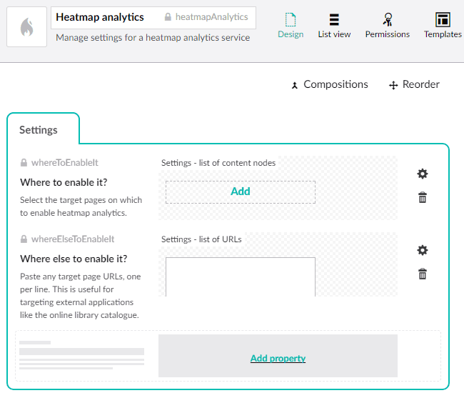

# Escc.Umbraco.HeatmapAnalytics

This project allows you to manage within Umbraco the URLs that a heatmap analytics service like Crazy Egg will be applied to.

### Step 1: Create a document type

Once this NuGet package is installed, create a document type in Umbraco to manage the settings. A suggested configuration is shown in the screenshot below, but the essential details are:

* the document type alias must be `heatmapAnalytics`
* there must be a property with the alias `whereToEnableIt` which uses the `Umbraco.MultiNodeTreePicker2` property editor
* there must be a property with the alias `whereElseToEnableIt` which uses the `Umbraco.TextboxMultiple` property editor
* in the Permissions section, allow the document type to be used at the root of the site

It is recommended that you save the document type to source control using [uSync](https://github.com/KevinJump/uSync).

### Step 2: Create a content node

Create a content node at the root of the site using the document type you created above, add the URLs where you want to enable heatmap analytics, then request the data from the following URL:

	https://hostname:port/umbraco/api/HeatmapAnalytics/GetHeatmapAnalyticsUrls

You should see JSON data representing the URLs you selected.

### Step 3: Use the data to initiate heatmap analytics 

See [heatmap-analytics.js](https://github.com/east-sussex-county-council/Escc.EastSussexGovUK/blob/master/Escc.EastSussexGovUK.TemplateSource/js/heatmap-analytics.js) in the `Escc.EastSussexGovUK` project for an example of how to read and apply the data. Include a similar script on every page where you may want heatmap analytics activated.

